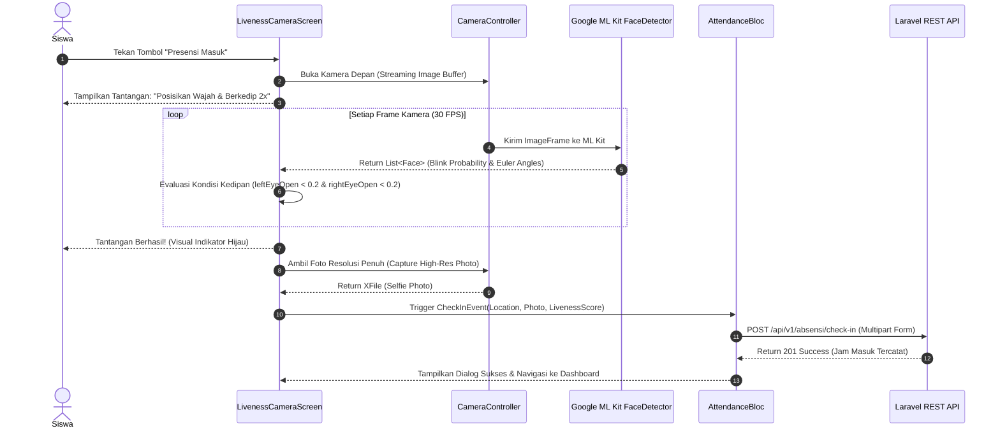

# 🏗️ FLUTTER MOBILE ARCHITECTURE BLUEPRINT
## Clean Architecture & Hardware Service Layer

Dokumen ini memuat arsitektur teknis aplikasi mobile Flutter untuk Sistem Presensi & Jurnal Prakerin SMK Negeri 3 Tuban.

---

## 1. Architectural Pattern (Clean Architecture)

Aplikasi dibangun menggunakan struktur **Clean Architecture (Feature-First)** untuk memastikan skalabilitas, *testability*, dan *maintainability* yang tinggi:

```text
lib/
├── app/
│   ├── config/ (Theme, Routes, Constants, Environment)
│   └── observers/ (BlocObserver / NavigatorObserver)
├── core/
│   ├── errors/ (Failures, Exceptions, ErrorHandler)
│   ├── network/ (DioClient, ApiInterceptors, NetworkInfo)
│   ├── services/ (LocationService, CameraService, FaceDetectorService, StorageService)
│   └── utils/ (HaversineHelper, DateFormatter, ImageCompressor)
└── features/
    ├── auth/ (Login, Device Binding, Face Enrollment)
    │   ├── data/ (Models, DataSources, RepositoriesImpl)
    │   ├── domain/ (Entities, UseCases, RepositoriesInterface)
    │   └── presentation/ (Bloc/Cubit, Pages, Widgets)
    ├── attendance/ (Geofence Radar, Liveness Camera, Check-in/Check-out)
    ├── journal/ (Daily Activity Log, Offline Draft, Photo Attachment)
    ├── history/ (Monthly Calendar, Attendance Stats, Review History)
    └── profile/ (Student Info, Industry Details, Device Status)
```

---

## 2. Tech Stack & Recommended Dependencies (pubspec.yaml)

| Kategori | Package Name | Fungsi |
| :--- | :--- | :--- |
| **State Management** | `flutter_bloc` & `equatable` | Manajemen state yang terstruktur dan mudah di-test |
| **Networking** | `dio` & `retrofit` | HTTP Client dengan support multipart upload & interceptor |
| **Local Storage & Cache** | `flutter_secure_storage` & `hive_flutter` | Penyimpanan token terenkripsi & draft jurnal offline |
| **Geolocation & Maps** | `geolocator` & `flutter_map` / `latlong2` | Pengambilan koordinat presisi & visualisasi radar geofence |
| **Camera & Computer Vision** | `camera` & `google_mlkit_face_detection` | Kamera live feed & On-Device Liveness Detection (Blink/Smile) |
| **Anti-Cheat & Security** | `trust_fall` & `safe_device` | Deteksi Fake GPS, Mock Location, Emulator, Root/Jailbreak |
| **Image Processing** | `flutter_image_compress` | Kompresi foto selfie & foto jurnal sebelum dikirim ke API |
| **Notifications** | `firebase_messaging` & `flutter_local_notifications` | Push notification jadwal absen dan reminder pengisian jurnal |

---

## 3. Diagram Alur Service Kamera & Liveness Detection (ML Kit)



---

## 4. Algoritma Deteksi Kedipan Mata (Eye Blink Liveness)

Implementasi evaluasi liveness on-device menggunakan rasio probabilitas mata terbuka dari Google ML Kit:

```dart
class LivenessDetector {
  bool _isEyeClosed = false;
  int _blinkCount = 0;

  bool processFaceFrame(Face face) {
    final double? leftOpen = face.leftEyeOpenProbability;
    final double? rightOpen = face.rightEyeOpenProbability;

    if (leftOpen == null || rightOpen == null) return false;

    // Ambang batas mata tertutup (kedipan)
    if (leftOpen < 0.25 && rightOpen < 0.25) {
      _isEyeClosed = true;
    } 
    // Mata kembali terbuka setelah tertutup = 1x kedipan valid
    else if (leftOpen > 0.75 && rightOpen > 0.75 && _isEyeClosed) {
      _blinkCount++;
      _isEyeClosed = false;
    }

    // Tantangan tercapai jika berkedip 2 kali secara natural
    return _blinkCount >= 2;
  }

  void reset() {
    _isEyeClosed = false;
    _blinkCount = 0;
  }
}
```

---

## 5. Offline-First Synchronization Strategy (Jurnal Harian)

1. Saat siswa menulis jurnal, teks dan path foto langsung disimpan ke local box **Hive**.
2. Service `ConnectivityInterceptor` mendeteksi status internet:
   - **Jika Online:** Data langsung diunggah via `POST /api/v1/jurnal`.
   - **Jika Offline:** Status jurnal ditandai `Draft (Tersimpan di HP)`.
3. Background task (menggunakan `workmanager` atau event saat aplikasi kembali online) akan otomatis mengunggah seluruh antrean draft jurnal yang tertunda.
