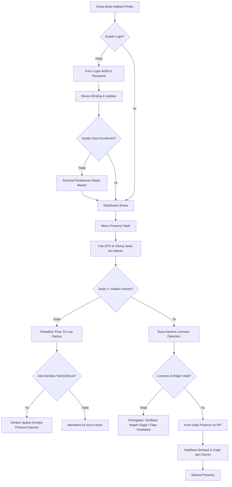

# 📱 PRODUCT REQUIREMENTS DOCUMENT (PRD) - ENHANCED
## Smart Geolocation & Face Verification Mobile Attendance & Daily Journal System (Prakerin SMK Negeri 3 Tuban)

---

## 1. Executive Summary & Problem Statement

### 1.1 Latar Belakang
Sistem Informasi Prakerin SMK Negeri 3 Tuban saat ini telah mengelola administrasi magang siswa, namun modul **Presensi (Absensi)** dan **Jurnal Harian** pada platform web memiliki celah operasional yang signifikan:
1. **Ketidakhadiran Fisik yang Tidak Tervalidasi:** Siswa dapat melakukan presensi dari mana saja (rumah/kost) tanpa validasi apakah mereka benar-benar berada di lokasi industri.
2. **Manipulasi Bukti Kehadiran:** Foto kehadiran dapat diunggah dari galeri tanpa verifikasi identitas wajah *real-time* atau *liveness detection*.
3. **Pencatatan Jam Masuk/Pulang Manual:** Siswa berpotensi memanipulasi jam masuk dan jam pulang.
4. **Keterlambatan Pelaporan Jurnal:** Jurnal harian sering ditumpuk di akhir minggu/bulan karena web kurang *mobile-friendly* dan tidak menyediakan fitur *reminder* instan.

### 1.2 Tujuan Proyek (Objective)
Mengembangkan **Mobile Application (Flutter)** dan **Backend RESTful API (Laravel 11)** yang mengintegrasikan:
- **Geofencing & Smart Location Validation:** Menghitung jarak GPS siswa secara *real-time* terhadap koordinat titik lokasi industri magang dengan toleransi radius dinamis (default: 300m, dapat dikonfigurasi hingga 1.500m untuk kawasan pabrik besar).
- **AI Face Verification & Liveness Detection:** Memverifikasi wajah siswa langsung melalui kamera depan dengan algoritma deteksi kedipan/gerakan (*anti-spoofing*) sebelum presensi diterima.
- **Emergency Fail-Safe & Attendance Correction:** Jalur khusus pengajuan presensi darurat saat terjadi kendala perangkat atau sinyal indoor.
- **Mobile Daily Journaling (Jurnal Harian):** Pengisian kegiatan harian magang dengan lampiran foto pekerjaan, waktu kerja, dan status verifikasi pembimbing secara terintegrasi.
- **Anti-Cheat & Fraud Prevention:** Memblokir Fake GPS (*Mock Location*), deteksi perangkat *Rooted/Jailbroken*, serta penguncian perangkat (*Device Binding*).

---

## 2. User Personas & Stakeholders

| Persona | Role | Kebutuhan Utama | Platform |
| :--- | :--- | :--- | :--- |
| **Siswa Magang** | End User | Presensi cepat dalam hitungan detik, cek radius kantor, refresh GPS, isi jurnal harian dengan foto, ajukan koreksi darurat jika HP bermasalah. | Mobile App (Flutter Android/iOS) |
| **Guru Pembimbing** | Reviewer & Mentor | Notifikasi jurnal baru, approval koreksi presensi darurat, review/tolak/setujui jurnal, pantau peta lokasi presensi & foto selfie siswa. | Web Dashboard & Mobile Web |
| **Kepala Jurusan (Kajur)** | Supervisor | Monitoring rekap kehadiran per jurusan, deteksi siswa bermasalah (alpha/terlambat berulang), eskalasi laporan masalah. | Web Dashboard |
| **Admin TU & Pimpinan** | Administrator | Manajemen titik koordinat & radius industri, manajemen multi-posko, reset binding perangkat, cetak sertifikat & rekap nilai. | Web Dashboard |

---

## 3. Product Features & Functional Requirements

### 3.1 Modul Otentikasi & Registrasi Wajah (Face Enrollment)
* **FR-AUTH-01 (Login Siswa):** Login menggunakan NISN dan Password dengan autentikasi berbasis Bearer Token (Laravel Sanctum).
* **FR-AUTH-02 (Device Binding):** Pada login pertama, aplikasi mengikat `device_id` (IMEI/UUID perangkat) ke akun siswa. Login di perangkat lain memerlukan konfirmasi reset perangkat oleh Admin.
* **FR-AUTH-03 (Face Enrollment - Satu Kali):** Pada saat pertama kali membuka aplikasi, siswa wajib melakukan registrasi wajah master (*enrollment*) dengan mengambil 3 sudut foto wajah (tengah, sedikit senyum, sedikit toleh) sebagai basis data perbandingan wajah.

---

### 3.2 Modul Presensi Berbasis Lokasi (Geofencing) & Verifikasi Wajah
* **FR-ABS-01 (Deteksi Lokasi GPS Real-time):** Aplikasi mengambil koordinat `latitude`, `longitude`, dan `accuracy` satelit GPS perangkat siswa.
* **FR-ABS-02 (Perhitungan Radius Industri Dinamis - Haversine Formula):** Sistem menghitung jarak antara titik siswa dan titik industri magang yang aktif.
  - Status: **"Di Dalam Radius"** (Jarak $\le$ Toleransi Radius Industri, default: 300m / sesuai pengaturan industri).
  - Status: **"Di Luar Radius"** (Jarak > Toleransi Radius Industri, tombol presensi terkunci).
* **FR-ABS-03 (Visual Radar Map & GPS Calibrator):** Peta interaktif menampilkan lingkaran radius industri (area hijau), titik posisi siswa, dan tombol **"Kalibrasi GPS / High Precision Fix"** untuk mengatasi sinyal lemah di dalam gedung (*indoor attenuation*).
* **FR-ABS-04 (Liveness Detection Camera):** Kamera depan terbuka otomatis dengan *circular overlay*. Siswa diminta melakukan tantangan interaktif acak (misal: "Berkedip 2x" atau "Tersenyum") untuk mencegah foto statis/layar HP lain.
* **FR-ABS-05 (Dual Check-in/Check-out):**
  - **Absen Masuk:** Jam masuk tercatat otomatis dari waktu server (bukan waktu lokal HP).
  - **Absen Pulang:** Terbuka setelah jam operasional minimum magang atau jam pulang industri tercapai.
* **FR-ABS-06 (Pengajuan Izin / Sakit):** Siswa dapat mengajukan status Izin/Sakit dengan melampirkan surat dokter/surat keterangan (PDF/Foto) tanpa validasi geofencing lokasi.
* **FR-ABS-07 (Pengajuan Koreksi Presensi / Emergency Fail-Safe):** Fitur darurat apabila HP siswa rusak, habis baterai, atau kamera bermasalah di lokasi magang. Siswa dapat mengajukan koreksi kehadiran yang wajib diverifikasi dan disetujui oleh Guru Pembimbing / Admin TU.
* **FR-ABS-08 (Multi-Zone Geofencing untuk Kawasan Industri Besar):** Admin dapat mendaftarkan lebih dari satu titik pos/gedung untuk industri skala besar (pabrik semen, kilang minyak, kawasan industri multi-plant).

---

### 3.3 Modul Jurnal Harian (Daily Activity Log)
* **FR-JRN-01 (Input Kegiatan Harian):** Form input tanggal, minggu ke-, uraian deskripsi kegiatan pekerjaan yang dilakukan, dan durasi pengerjaan (dalam jam).
* **FR-JRN-02 (Lampiran Foto Dokumentasi Multi-Upload):** Upload 1-3 foto dokumentasi pekerjaan langsung dari kamera atau galeri dengan kompresi otomatis di sisi klien (*client-side compression*).
* **FR-JRN-03 (Status Approval Jurnal):**
  - `pending` (Kuning) - Menunggu verifikasi Guru Pembimbing.
  - `disetujui` (Hijau) - Kegiatan disahkan oleh pembimbing.
  - `ditolak` / `perlu_revisi` (Merah) - Disertai catatan perbaikan dari pembimbing.
* **FR-JRN-04 (Offline Draft Caching):** Jika sinyal internet di lokasi pabrik buruk, jurnal harian tersimpan sebagai *Draft* lokal di perangkat dan dapat di-*sync* saat kembali online.

---

### 3.4 Modul Riwayat, Statistik & Notifikasi
* **FR-NOTIF-01 (Push Notification):** Pengingat otomatis absensi masuk (pukul 07:00), pengingat absen pulang (pukul 16:00), dan pengingat isi jurnal harian (pukul 18:00).
* **FR-STAT-01 (Rekap Kalender Presensi):** Tampilan kalender interaktif dengan indikator warna: Hijau (Hadir), Kuning (Izin), Biru (Sakit), Merah (Alpha), Ungu (Koreksi Disetujui).
* **FR-STAT-02 (Status Penempatan Magang):** Informasi detail perusahaan, kontak pembimbing industri, nama guru pembimbing sekolah, dan sisa hari magang.

---

## 4. Non-Functional Requirements (NFR)

| Kategori | Spesifikasi | Target Metrik |
| :--- | :--- | :--- |
| **Response Time API** | Waktu pemrosesan request presensi & kalkulasi jarak | $< 800\text{ ms}$ pada jaringan 4G |
| **Akurasi GPS** | Ambang batas akurasi pembacaan GPS perangkat | Maksimal deviasi $\le 30\text{ - }50\text{ meter}$ |
| **Face Liveness Latency** | Deteksi wajah & liveness di sisi perangkat (On-Device) | Realtime 30 FPS via ML Kit |
| **Ukuran Payload Gambar** | Kompresi foto sebelum upload ke server | Maksimal $500\text{ KB}$ per foto |
| **Keamanan Data** | Enkripsi transmisi API & Token storage | HTTPS TLS 1.3, Encrypted Shared Preferences / Flutter Secure Storage |
| **Toleransi Geofence** | Radius lokasi kantor/industri | $300\text{ meter}$ (Default) s/d $1.500\text{ meter}$ (Kawasan Pabrik) |

---

## 5. User Journey & Flowcharts

---

## 6. Acceptance Criteria (Kriteria Keberterimaan)

1. **Geofencing Dinamis:** Siswa yang berada di luar batas radius yang ditentukan untuk industri terkait (misal: $> 300\text{m}$ untuk ruko, atau $> 1.000\text{m}$ untuk pabrik semen) **tidak dapat** menekan tombol presensi masuk/pulang.
2. **Fake GPS Blocking:** Jika aplikasi mendeteksi opsi pengembang *Allow Mock Locations* aktif atau aplikasi Fake GPS terpasang, aplikasi menolak presensi dengan error `MOCK_LOCATION_DETECTED`.
3. **Face Verification:** Presensi tidak dapat dipalsukan menggunakan foto statis, kertas cetak, atau foto dari layar smartphone lain.
4. **Emergency Fail-Safe:** Siswa yang mengalami kendala hardware dapat mengirim tiket koreksi yang langsung masuk ke antrean approval Guru Pembimbing.
5. **Sinkronisasi Jurnal:** Jurnal harian yang diisi di aplikasi mobile langsung muncul secara instan di Web Dashboard Guru Pembimbing untuk diverifikasi.
