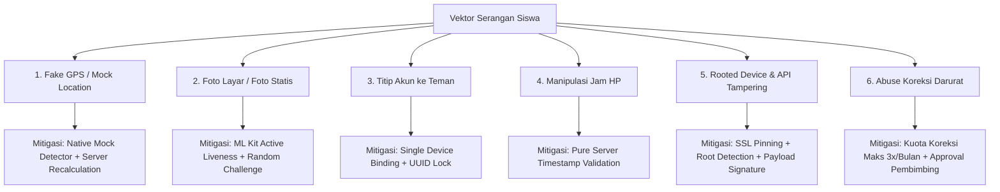

# 🛡️ ANALISIS KEAMANAN, ANTI-CHEAT & REKOMENDASI STRATEGIS - ENHANCED
## Senior Engineering Security Audit & Cheat Mitigation Strategy

Dokumen ini memuat analisis kritis terhadap potensi celah manipulasi kehadiran siswa SMK dan strategi mitigasi teknis berlapis (*defense-in-depth*).

---

## 1. Analisis Celah Kecurangan (Cheat Vectors & Vulnerabilities)

Siswa SMK (terutama jurusan RPL, TKJ, dan Teknik Komputer) memiliki literasi digital yang cukup tinggi untuk mencoba memanipulasi sistem presensi mobile. Berikut 5 vektor serangan utama:

---

## 2. Rincian Mitigasi Teknis Berlapis (*Defense-in-Depth*)

### 2.1 Pencegahan Fake GPS & Mock Location
* **Celah:** Siswa mengaktifkan *Developer Options -> Select mock location app* (misal: Fake GPS Location) untuk memalsukan posisi di kantor magang saat mereka masih di rumah.
* **Mitigasi Client (Flutter):**
  - Menggunakan API bawaan `geolocator.isMockLocation` (Android API 31+ `isMock()` / iOS `isSimulatedBySoftware`).
  - Menggunakan plugin `safe_device` untuk mendeteksi apakah lokasi berasal dari mock provider.
  - Membaca `accuracy` GPS: Jika akurasi bernilai `0.0` atau tepat `1.0` secara konstan, lokasi dicurigai berasal dari emulator / fake GPS generator.
* **Mitigasi Server (Laravel API):**
  - **Kalkulasi Jarak Wajib di Backend:** Backend tidak pernah mempercayai parameter `is_within_radius` dari HP siswa. Backend mengambil koordinat `latitude` & `longitude` dari payload, mengambil titik industri dari database, lalu menghitung ulang jarak menggunakan rumus **Haversine**.

---

### 2.2 Pencegahan Manipulasi Biometrik Wajah (Anti-Face Spoofing)
* **Celah:** Siswa mengarahkan kamera ke foto pasfoto cetak, foto selfie di layar laptop, atau foto di HP teman.
* **Mitigasi (Active Liveness Detection):**
  - **Tantangan Dinamis Acak (Random Challenge):** Aplikasi tidak langsung mengambil foto. Aplikasi meminta aksi acak yang harus dilakukan dalam rentang 3 detik:
    - Sesi A: *Berkedip 2 kali*
    - Sesi B: *Tersenyum lalu mengangguk*
    - Sesi C: *Menoleh ke kiri 15 derajat*
  - Menggunakan **Google ML Kit Face Detection (Vision SDK)** secara *on-device* untuk membaca probabilitas mata terbuka (`leftEyeOpenProbability`, `rightEyeOpenProbability`), senyuman (`smilingProbability`), dan sudut rotasi kepala (`headEulerAngleY`, `headEulerAngleZ`).

---

### 2.3 Pencegahan Titip Absen (Device Binding Lock)
* **Celah:** Siswa A memberikan username/password ke Siswa B yang berada di kantor agar Siswa B mengabsenkan Siswa A dari HP-nya.
* **Mitigasi:**
  - Saat login pertama kali, aplikasi membaca pengenal perangkat keras yang unik (`device_id` / Android ID / iOS IdentifierForVendor) dan menyimpannya di tabel `siswas.device_id`.
  - Jika Siswa B mencoba login menggunakan akun Siswa A di HP Siswa B, server menolak dengan error `DEVICE_MISMATCH`.
  - Hanya Admin TU atau Guru Pembimbing yang memiliki otoritas untuk me-reset ikatan perangkat (*device reset*) jika siswa mengganti HP atau HP hilang.

---

### 2.4 Pencegahan Manipulasi Jam (Time-Travel Defense)
* **Celah:** Siswa memundurkan jam di pengaturan Android/iOS agar tidak tercatat terlambat.
* **Mitigasi:**
  - Waktu jam masuk dan jam pulang **100% diambil dari jam server Laravel (`now()`)** di database, bukan dari waktu yang dikirim oleh perangkat handphone.

---

### 2.5 Deteksi Root / Jailbreak & SSL Pinning
* **Celah:** Menggunakan Magisk / Xposed / Frida untuk me-hook fungsi geolokasi atau memodifikasi response API.
* **Mitigasi:**
  - Pengecekan status *Root / Jailbroken* menggunakan library `flutter_jailbreak_detection` / `trust_fall`. Jika perangkat ter-root, aplikasi menampilkan peringatan dan menonaktifkan fitur presensi.
  - Implementasi **SSL Certificate Pinning** pada HTTP Client Dio untuk mencegah serangan *Man-In-The-Middle (MITM)* via Burp Suite atau Charles Proxy.

---

### 2.6 Pencegahan Abuse Fitur Koreksi Darurat (Anti-Abuse Fail-Safe)
* **Celah:** Siswa malas absen di lokasi lalu sengaja memanfaatkan menu koreksi darurat setiap hari dari rumah.
* **Mitigasi:**
  - **Batas Kuota Bulanan:** Maksimal pengajuan koreksi presensi darurat dibatasi maksimal **3 kali per bulan**. Jika melebihi kuota, sistem mengunci form dan mewajibkan konfirmasi langsung dari orang tua / pembimbing lapangan.
  - **Notifikasi Peringatan ke Pembimbing:** Setiap ada pengajuan koreksi, notifikasi push langsung masuk ke Guru Pembimbing untuk dikroscek ke HRD / kontak industri.

---

## 3. Rangkuman Panduan Implementasi Bertahap (Sprint Execution Plan)

| Fase | Fokus | Deliverables |
| :--- | :--- | :--- |
| **Sprint 1** | Backend API & Database | Setup Laravel Sanctum, Migrasi tabel Geolocation (`industris`, `absensis`, `koreksi_absensis`, `jurnal_fotos`), Geofence Haversine Service. |
| **Sprint 2** | Flutter Core & Auth | Setup Clean Architecture, Dio Interceptor, Login NISN, Device Binding, Face Enrollment Screen. |
| **Sprint 3** | Geofencing & Liveness Camera | Integrasi `geolocator`, OpenStreetMap Radar, ML Kit Liveness Face Detection, Check-in / Check-out Flow. |
| **Sprint 4** | Daily Journal & Offline Sync | Form Jurnal Harian, Kompresi Foto, Hive Local Caching, Upload Background Sync. |
| **Sprint 5** | Security Hardening & Testing | Fake GPS blocking, Anti-root test, Field testing di lokasi industri, Approval Dashboard Guru Pembimbing. |
